Google Chrome browser has been my favorite browser for development for quite some time. And the Dev Tools capabilities is one of the reasons for that.

Below you will find a list of cool tricks and tips I've found in Chrome Dev Tools over the years.

1. [Dev Tools theme](#1-dev-tools-theme)
2. [Dev Tools panel layout](#2-dev-tools-panel-layout)
3. [Switch between Dev Tools panels](#3-switch-between-dev-tools-panels)
4. [Switch between CSS properties](#4-switching-between-css-properties)
5. [Toggle element visibility](#5-toggle-element-visibility)
6. [Edit element attributes](#6-edit-element-attributes)
7. [Search DOM tree](#7-search-dom-tree)
8. [Add devices](#8-add-devices)
9. [Add new styles shortcut](#9-add-new-styles-shortcut)
10. [Edit any text content on the page](#10-edit-any-text-content-on-the-page)
11. [Store value as a global variable in console](#11-store-value-as-a-global-variable-in-console)
12. [Increment CSS values](#12-increment-css-values)
13. [DOM elements as global variables](#13-dom-elements-as-global-variables)
14. [Switch between color formats](#14-switch-between-color-formats)
15. [Return the value of the last expression evaluated in the console](#15-return-the-value-of-the-last-expression-evaluated-in-the-console)
16. [Bonus: Expand all sub-properties of an object that's been logged to the console](#bonus-expand-all-sub-properties-of-an-object-thats-been-logged-to-the-console)

## 1. Dev Tools theme
There's a way to toggle between Light and Dark theme for Dev Tools. Inside *Settings* under *Appearance* choose between Light and Dark themes.

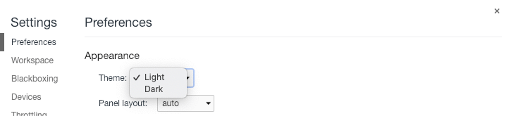

## 2. Dev Tools panel layout
In some cases, it is more comfortable to work with a certain type of panel layout.
You can select between three possible layouts:
* horizontal;
* vertical;
* auto.

It can be set inside *Settings* under *Appearance*.

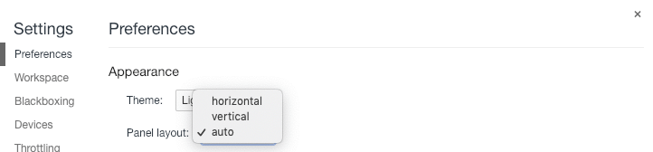

## 3. Switch between Dev Tools panels
There's an easy way to switch between Dev Tools panels via keyboard.
* <kbd>cmd</kbd> + <kbd>1-9</kbd> for MAC;
* <kbd>ctrl</kbd> + <kbd>1-9</kbd> for Windows and Linux.

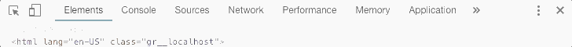

## 4. Switching between CSS properties
While in the *Styles* panel click on the CSS property and press:
* <kbd>tab</kbd> to jump to the next property;
* <kbd>tab</kbd> + <kbd>shift</kbd> to jump to the previous property.

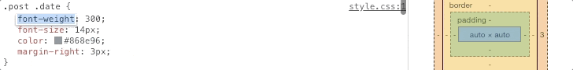

## 5. Toggle element visibility
You can easily toggle element visibility inside element DOM tree by pressing <kbd>h</kbd> key on selected element.

## 6. Edit element attributes
Inside element DOM tree press <kbd>enter</kbd> key on the selected element to edit attribute. Press <kbd>tab</kbd> to edit next attribute, press <kbd>tab</kbd> + <kbd>shift</kbd> edit previous attribute.

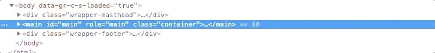

## 7. Search DOM tree
To find any attribute, element, content or any other string inside DOM tree just press:
* <kbd>cmd</kbd> + <kbd>f</kbd> for MAC;
* <kbd>ctrl</kbd> + <kbd>f</kbd> for Windows and Linux.

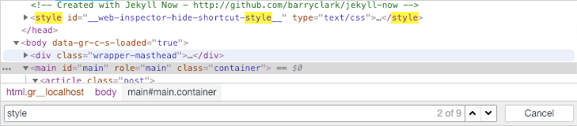

## 8. Add devices
You can enable/disable existing devices or add a custom device inside *Device toolbar*.
Inside *Settings* click on the *Devices* tab. You will see a list of existing devices where you can enable/disable devices. Or you can add a new one by clicking on the *Add custom device...* button.

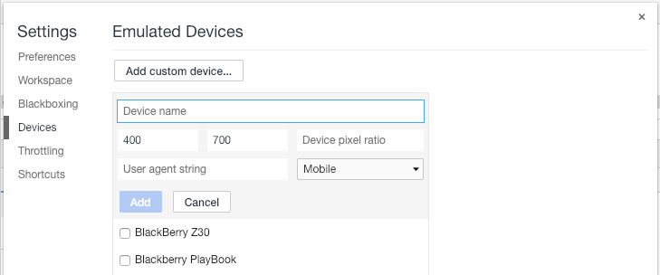

## 9. Add new styles shortcut
To quickly add a new style like:
* Color;
* Background color;
* Text-shadow;
* Box-shadow.

Hover over a small icon ( **&vellip;** ) in the bottom left corner and the above options will appear.
To insert a new style rule below click on the **+** icon.

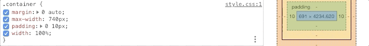

## 10. Edit any text content on the page
In the console write `document.designMode = "on"` and you will be able to edit any text content on the page instantly.

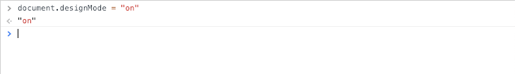

## 11. Store value as a global variable in console
Any returned data of *object* or *function* type can be stored as a global variable in the console. E.g. `console.log(['a', 'b'])` will return an array. Right click on it and select **Store as a global variable** which will be accessible via `temp1` keyword in the console.

**Note:** These variables are temporary and are only available during the current session, meaning after page refresh they will be gone.

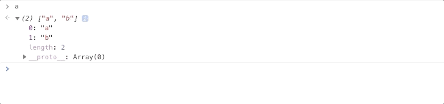

## 12. Increment CSS values
Numeric CSS values can easily be incremented and decremented by using certain key combinations:

* Increment value by 1 <kbd>&uarr;</kbd>;
* Dcrement value by 1 <kbd>&darr;</kbd>;
* Increment value by 0.1 <kbd>alt</kbd> + <kbd>&uarr;</kbd>;
* Dcrement value by 0.1 <kbd>alt</kbd> + <kbd>&darr;</kbd>;
* Increment value by 10 <kbd>shift</kbd> + <kbd>&uarr;</kbd>;
* Dcrement value by 10 <kbd>shift</kbd> + <kbd>&darr;</kbd>;
* Increment value by 100 <kbd>cmd</kbd> + <kbd>&uarr;</kbd> (MAC), <kbd>ctrl</kbd> + <kbd>&uarr;</kbd> (Windows and Linux);
* Dcrement value by 100 <kbd>cmd</kbd> + <kbd>&darr;</kbd> (MAC),  <kbd>ctrl</kbd> + <kbd>&darr;</kbd> (Windows and Linux).

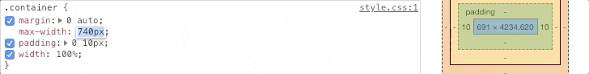

## 13. DOM elements as global variables
A DOM element can be stored and accessed as a global variable in the console. In the DOM tree right click on the element tag and click **Store as a global variable**.

**Note:** These variables are temporary and are only available during the current session, meaning after page refresh they will be gone.

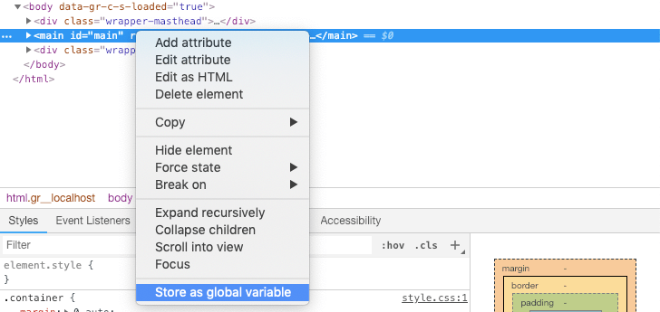

## 14. Switch between color formats
You can easily change the color format by holding <kbd>shift</kbd> key and click on the **Color Preview** box next to the value.

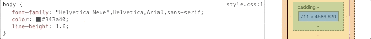

## 15. Return the value of the last expression evaluated in the console
`$_` in the Console returns the value of the last expression evaluated.

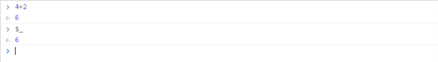

## Bonus: Expand all sub-properties of an object that's been logged to the console
Once the object is logged, hold <kbd>alt</kbd> key and click expand **&#x025B8;** icon.

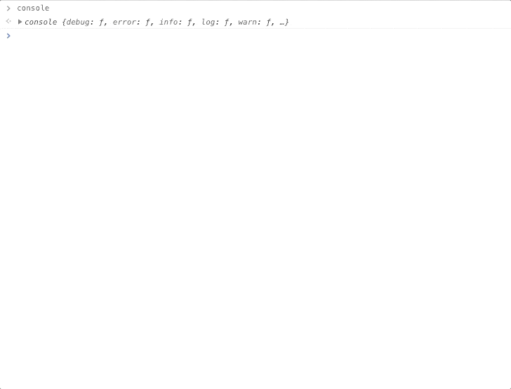

---

