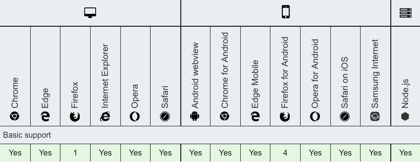
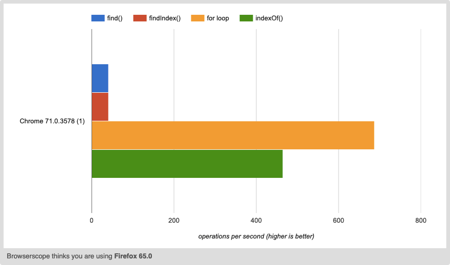

In this article, I'm going to show several ways of how to find an item in a JavaScript array. As well as provide a performance test for all of the methods.

1. [`Array.prototype.find()`](#find-method)
2. [`Array.prototype.findIndex()`](#findindex-method)
3. [`Array.prototype.indexOf()`](#indexof-method)
4. [`for` loop](#for-loop)

## find() method
> The `find()` method returns the value of the first element in the array that satisfies the provided testing function. Otherwise `undefined` is returned.
>
>&mdash;<cite>MDN</cite>

This method allows passing a callback function as a parameter. Which in turn allows to make a more complex comparison and conditioning to find an item. Useful when need to find an object property.

**Example [ES6 syntax]**
```javascript
const numbers = ['one', 'two', 'three', 'five', 'eight', 'thirteen']

const findItem = numbers.find(number => number === 'five')

console.log(findItem) // 'five'
```

**Pros**
* Straightforward and easy to understand syntax. If you're using ES6;
* Callback function allows to handle complex logic;
* Ability to find an item if it is an object.

**Cons**
* Slow performance compared to other approaches.

Check out MDN full docs on [find() method](https://developer.mozilla.org/en-US/docs/Web/JavaScript/Reference/Global_Objects/Array/find){:target="blank"}.

**Browser support** for `find()`:

 method browser support")

## findIndex() method
> The `findIndex()` method returns the index of the first element in the array that satisfies the provided testing function. Otherwise, it returns -1, indicating no element passed the test.
>
> &mdash;<cite>MDN</cite>

Initially this method does exactly the same as `find()` method above. Useful when need to get a specific index of an array item.

**Example [ES6 syntax]**
```javascript
const numbers = ['one', 'two', 'three', 'five', 'eight', 'thirteen']

const itemIndex = numbers.findIndex(number => number === 'five')

console.log(itemIndex) // 3
```

**Pros**
* Straightforward and easy to understand syntax. If you're using ES6;
* Callback function allows to handle complex logic;
* Ability to find an item if it is an object.

**Cons**
* Slow performance compared to other approaches.

Check out MDN full docs on [findIndex() method](https://developer.mozilla.org/en-US/docs/Web/JavaScript/Reference/Global_Objects/Array/findIndex){:target="blank"}.

**Browser support** for `findIndex()`:

 method browser support")

## indexOf() method
> The `indexOf()` method returns the first index at which a given element can be found in the array, or `-1` if it is not present.
>
> &mdash;<cite>MDN</cite>

Unlike `find()` and `findIndex()` methods, `indexOf()` can take to parameters:
1. searched item: usually a number or a string;
2. start position: a numeric value specifying the index to start the search at.

The downside of this method is it will work only on a single level array containing number or/and string value types.

**Example [ES6 syntax]**
```javascript
const numbers = ['one', 'two', 'three', 'five', 'eight', 'thirteen']

const itemIndex = numbers.indexOf('five')
const itemIndexPos = numbers.indexOf('five', 4)

console.log(itemIndex) // 3
console.log(itemIndexPos) // -1
```

**Pros**
* Straightforward and easy to understand syntax. If you're using ES6;
* Relatively high performance compared to other approaches.

**Cons**
* Inability to find an item if it is an object.

Check out MDN full docs on [indexOf() method](https://developer.mozilla.org/en-US/docs/Web/JavaScript/Reference/Global_Objects/Array/indexOf){:target="blank"}.

**Browser support** for `indexOf()`:

 method browser support")

## for loop
> The `for` statement creates a loop that consists of three optional expressions, enclosed in parentheses and separated by semicolons, followed by a statement (usually a block statement) to be executed in the loop.
>
> &mdash;<cite>MDN</cite>

This is the very basic JavaScript construction that can loop over the array and depending on a condition can populate a variable with a value. This approach is not very popular due to JavaScript nowadays have a lot of native methods to manipulate arrays, like the ones listed above.

I thought it was worth to mention this one because:
1. in the rare cases `for` loops is the way to go;
2. for loop is completely cross-browser.

**Example**
```javascript
const numbers = ['one', 'two', 'three', 'five', 'eight', 'thirteen']

let item

for (let i = 0; i < numbers.length; i++) {
  if (numbers[i] === 'five') {
  	item = numbers[i]
  	break
  }
}

console.log(item) // 'five'
```

**Pros**
* Best performance compared to other approaches;
* Ability to implement custom logic.

**Cons**
* Not so elegant and clean solution compared to other approaches.

Check out MDN full docs on [for loop](https://developer.mozilla.org/en-US/docs/Web/JavaScript/Reference/Statements/for){:target="blank"}.

**Browser support** for `for` loop:



## jsperf performance test

To compare the performance between all of these ways, I've created a test at [https://jsperf.com/find-item-in-an-array/](https://jsperf.com/find-item-in-an-array/){:target="blank"}.

The test is pretty simple, it creates an array of numbers and then tests each approach against this array. Each test case searches for the first, middle and last value of an array.

Test results:


Test results chart snapshot:



As you can see the `for` loop is the fastest way to find an item in an array.

