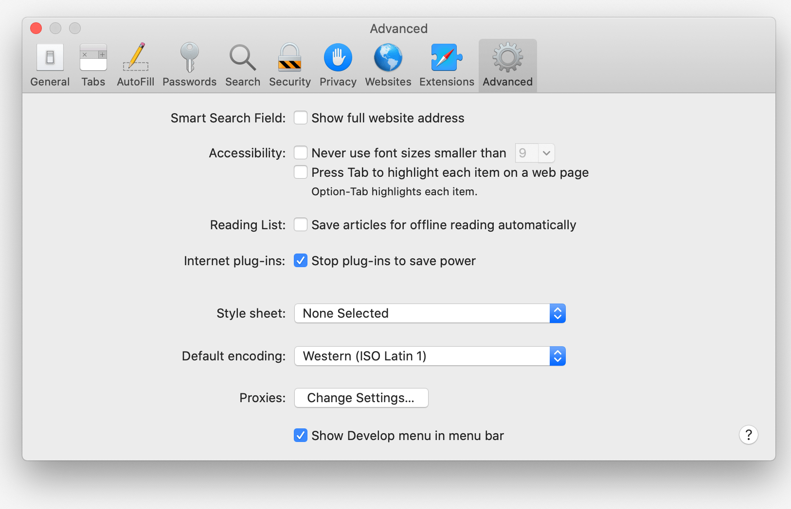

Set up a local environment to develop and debug a web project for an iPhone/iPad device.

This will allow you to inspect elements, use browser console and other development tools that are available in the [Safari browser](https://developer.apple.com/safari/tools/){:target="blank"} right on your mobile device.

**NOTE: This manual will work only for Apple devices. This means that you have to have a MAC computer and an iPhone/iPad.**

1. [Setting up a mobile device (iPhone/iPad)](#1-setting-up-a-mobile-device-iphoneipad)
2. [Setting up a MAC](#2-setting-up-a-mac-iphoneipad)
3. [Entering Inspector](#3-entering-inspector)
4. [Tips](#4-tips)

## 1. Setting up a mobile device (iPhone/iPad)

Before connecting a mobile device to a MAC, you'll need to enable the **Web Inspector**. This will allow you to use your MAC Safari Developer Tools on your mobile device.

On a mobile device go to:

**Settings > Safari > Advanced > Web Inspector**

and enable the Web Inspector switch.

<figure class="image-container">
  
</figure>

## 2. Setting up a MAC (iPhone/iPad)

You'll need to enable Develop menu in order to access Dev tools if you haven't already.

Open up Safari browser go to **Preferences** and tick _Show Develop menu in menu bar_ checkbox.

<figure class="image-container">
  
</figure>

## 3. Entering Inspector

Connect your device to a computer via cable.

**NOTE: you might need to click on trust this computer button if you haven't already**

Open the Safari browser on your device and go to a webpage. Now open a Safari browser on your computer and click on a Develop in a menu. Hover over _Develop_ in the menu and you'll see your device's name and a web page. Click on it and the inspector will open.

<figure class="image-container">
  
</figure>

At this point, you can use element inspector and other tools just like you do on a computer.

<figure class="image-container">
  
</figure>

<figure class="image-container">
  
</figure>

## 4. Tips

A quick tip while debugging you might want to clear browser cache, to do that go to:

**Settings > Safari > Clear History and Website Data**

and click **Clear History and Data**.

<figure class="image-container">
  
</figure>

